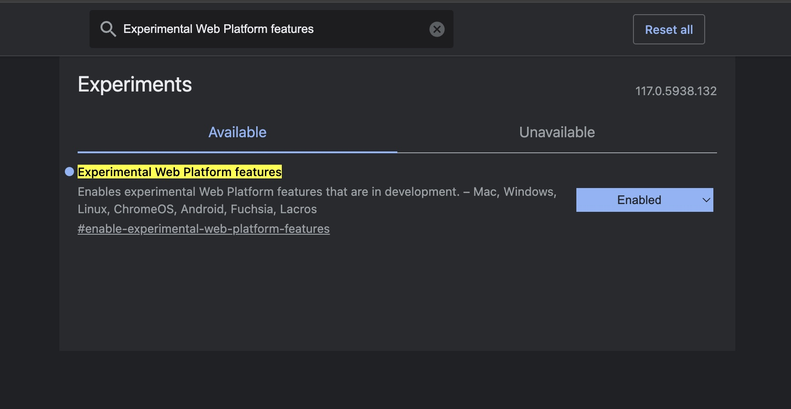

# CSS Scope

This is a companion project to my upcoming LogRocket post on using `@scope` to refactor Block Element Modifier (BEM) projects in Chrome.

The [Chrome 118](https://chromestatus.com/feature/5100672734199808) release includes the `@scope` feature which could make styling easier for Frontend developers.

As of 10/02/2023 the `@scope` feature is still in experimental status. To turn on the `@scope` feature in Chrome, open chrome and then go to `chrome://flags/` in a new tab. Find the `Experimental Web Platform features` flag and click "enable". Relaunch Chrome and it should be working.

## Project Examples

The project includes 2 different examples of using `@scope`.

In the `html-css` folder, an example was modified from one originally seen in the Bram.us post [A Quick Introduction to CSS Scope](https://www.bram.us/2023/08/22/a-quick-introduction-to-css-scope/). To run this project, one can either open the invidual HTML files in Chrome or using `http-server` by (1) running `npm install` on the root project and then (2) run `npm run start-html`. Go to `http://localhost:8080/no_scope.html` and `http://localhost:8080/with_scope.html` to see it running locally. Example picture is of my Dog Harvey.

In the `react-exaple` folder, there is an example of a react project that has a BEM component that is also refactored into a `@scope` component. To run that from the project root, run `npm run start-react` and you can view it on `localhost:3000`. The BEM vs. `@scope` components are all named approriately so the BEM versions have `WithBEM` and the `@scope` versions have `WithScope` in them.
